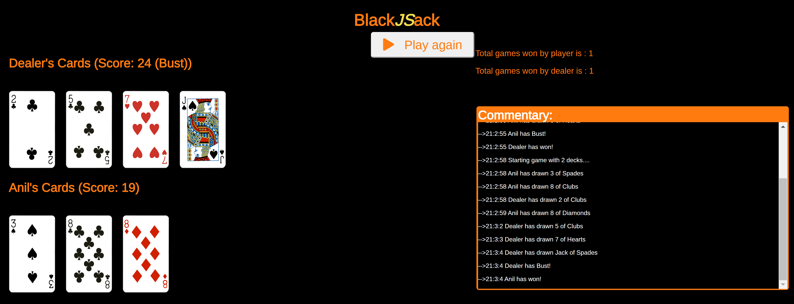

## Features of game:

- Button for hit and stand
- Scoreboard for player vs dealer in that session (no state stored on refresh)
- Terminal styled auto scrolling text commentary during gameplay
- Update score on screen when game is ongoing
- Overlay screen with winner and loser status.

## Game rules:
- Ace + 10 card = Blackjack. If both have Blackjack, winner is one with natural Blackjack (i.e. 2 card blackjack beats a 3 or 4 card blackjack)
- If Player 'stands', dealer has to 'hit' till reaching or exceeding total of 17 .
